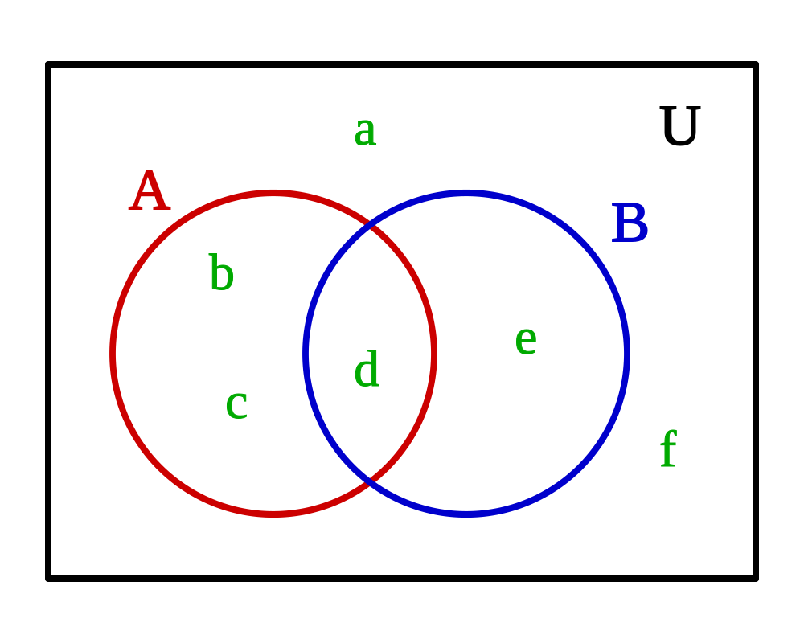

The basic types of Definitions used most commonly throughout ECL coding are: **Boolean**, **Value**, **Set**, **Record Set**, and **TypeDef**.

## Boolean Definitions

A Boolean Definition is defined as any Definition whose definition is a logical expression resulting in a TRUE/FALSE result. For example, the following are all Boolean Definitions:




```ecl

IsBoolTrue  := TRUE;
IsFloridian := Person.per_st = 'FL';
IsOldPerson := Person.Age >= 65;

```

## Value Definitions

A Value Definition is defined as any Definition whose expression is an arithmetic or string expression with a single-valued result. For example, the following are all Value Definitions:

```ecl

ValueTrue      := 1;
FloridianCount := COUNT(Person(Person.per_st = 'FL'));
OldAgeSum     := SUM(Person(Person.Age >= 65),Person.Age);

```

## Set Definitions

A Set Definition is defined as any Definition whose expression is a set of values, defined within square brackets. Constant sets are created as a set of explicitly declared constant values that must be declared within square brackets, whether that set is defined as a separate definition or simply included in-line in another expression. All the constants must be of the same type.

```ecl

SetInts  := [1,2,3,4,5]; // an INTEGER set with 5 elements
SetReals := [1.5,2.0,3.3,4.2,5.0];
            // a REAL set with 5 elements
SetStatusCodes := ['A','B','C','D','E'];
            // a STRING set with 5 elements

```

The elements in any explicitly declared set can also be composed of arbitrary expressions. All the expressions must result in the same type and must be constant expressions.

```ecl

SetExp := [1,2+3,45,SomeIntegerDefinition,7*3];
                        // an INTEGER set with 5 elements
```

Declared Sets can contain definitions and expressions as well as constants as long as all the elements are of the same result type. For example:

```ecl

StateCapitol(STRING2 state) :=
          CASE(state, 'FL' => 'Tallahassee', 'Unknown');
SetFloridaCities := ['Orlando', StateCapitol('FL'), 'Boca '+'Raton',
          person[1].per_full_city];
```

Set Definitions can also be defined using the SET function (which see). Sets defined this way may be used like any other set.

```ecl
SetSomeField := SET(SomeFile, SomeField);
          // a set of SomeField values
```

Sets can also contain datasets for use with those functions (such as: MERGE, JOIN, MERGEJOIN, or GRAPH) that require sets of datsets as input parameters.

```ecl
SetDS := [ds1, ds2, ds3]; // a set of datasets
```

## Set Ordering and Indexing

Sets are implicitly ordered and you may index into them to access individual elements. Square brackets are used to specify the element number to access. The first element is number one (1).

```ecl

MySet := [5,4,3,2,1];
ReverseNum := MySet[2]; //indexing to MySet's element number 2,
                       //so ReverseNum contains the value 4
```

Strings (Character Sets) may also be indexed to access individual or multiple contiguous elements within the set of characters (a string is treated as though it were a set of 1-character strings). An element number within square brackets specifies an individual character to extract.

```ecl
MyString := 'ABCDE';
MySubString := MyString[2]; // MySubString is 'B'

```

Substrings may be extracted by using two periods to separate the beginning and ending element numbers within the square brackets to specify the substring (string slice) to extract. Either the beginning or ending element number may be omitted to indicate a substring from the beginning to the specified element, or from the specified element through to the end.

```ecl
MyString := 'ABCDE';
MySubString1 := MyString[2..4]; // MySubString1 is 'BCD'
MySubString2 := MyString[ ..4]; // MySubString2 is 'ABCD'
MySubString3 := MyString[2.. ]; // MySubString3 is 'BCDE'
```

## Record Set Definitions

The term "Dataset" in ECL explicitly means a "physical" data file in the supercomputer (on disk or in memory), while the term "Record Set" indicates any set of records derived from a Dataset (or another Record Set), usually based on some filter condition to limit the result set to a subset of records. Record sets are also created as the return result from one of the built-in functions that return result sets.

A Record Set Definition is defined as any Definition whose expression is a filtered dataset or record set, or any function that returns a record set. For example, the following are all Record Set Definitions:

```ecl

FloridaPersons    := Person(Person.per_st = 'FL');
OldFloridaPersons := FloridaPersons(Person.Age >= 65);

```

## Record Set Ordering and Indexing

All Datasets and Record Sets are implicitly ordered and may be indexed to access individual records within the set. Square brackets are used to specify the element number to access, and the first element in any set is number one (1).

Datasets (including child datasets) and Record Sets may use the same method as described above for strings to access individual or multiple contiguous records.

```ecl

MyRec1 := Person[1];     // first rec in dataset
MyRec2 := Person[1..10]; // first ten recs in dataset
MyRec4 := Person[2..];   // all recs except the first

```

**Note:** ds[1] and ds[1..1] are not the same thing--ds[1..1] is a recordset (may be used in recordset context) while ds[1] is a single row (may be used to reference single fields).

And you can also access individual fields in a specified record with a single index:

```ecl
MyField := Person[1].per_last_name; // last name in first rec
```

Indexing a record set with a value that is out of bounds is defined to return a row where all the fields contain blank/zero values. It is often more efficient to index an out of bound value rather than writing code that handles the special case of an out of bounds index value.

For example, the expression:

```ecl
IF(COUNT(ds) > 0, ds[1].x, 0);
```

is simpler as:

```ecl

ds[1].x    //note that this returns 0 if ds contains no records.
```

## TypeDef Definitions

A TypeDef Definition is defined as any Definition whose definition is a value type, whether built-in or user-defined. For example, the following are all TypeDef Definitions (except GetXLen):

```ecl

GetXLen(DATA x,UNSIGNED len) := TRANSFER(((DATA4)(x[1..len])),UNSIGNED4);

EXPORT xstring(UNSIGNED len) := TYPE
  EXPORT INTEGER PHYSICALLENGTH(DATA x) := GetXLen(x,len) + len;
  EXPORT STRING LOAD(DATA x) := (STRING)x[(len+1)..GetXLen(x,len) + len];
  EXPORT DATA STORE(STRING x):= TRANSFER(LENGTH(x),DATA4)[1..len] + (DATA)x;
END;

pstr := xstring(1); // typedef for user defined type
pppstr := xstring(3);
nameStr := STRING20; // typedef of a system type

namesRecord := RECORD
  pstr surname;
  nameStr forename;
  pppStr addr;

END;
//A RECORD structure is also a typedef definition (user-defined)

```
